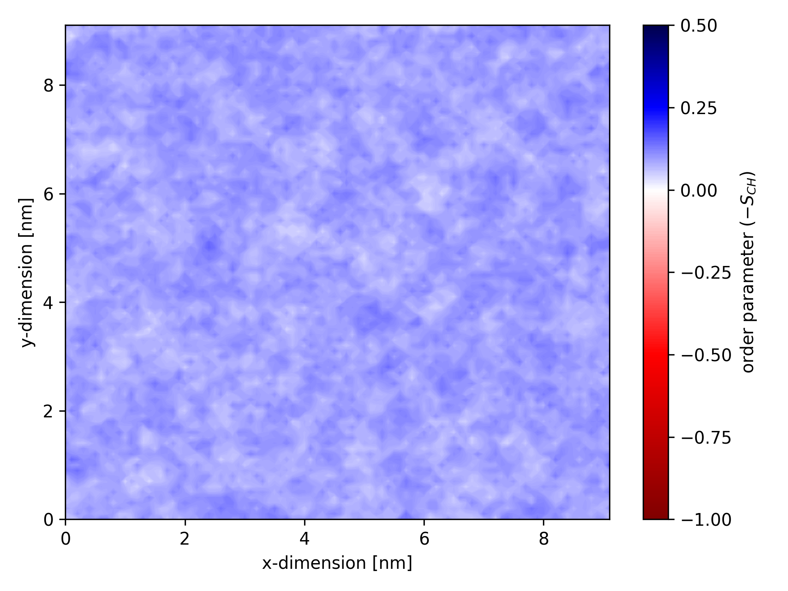
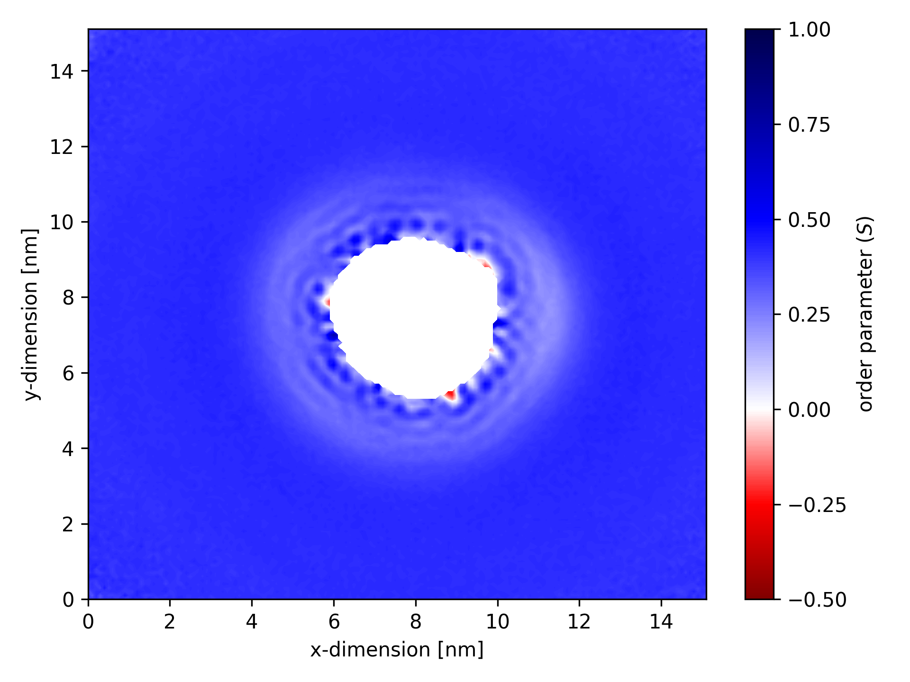

# Maps of order parameters

## Basic analysis

`gorder` can create maps of order parameters ("ordermaps") for the individual bond types and atom types. To construct an ordermap, the membrane plane is mapped onto a grid with bins of a specified size. Order parameters calculated for individual bonds are projected into the respective bins based on the position of the bond center. The average order parameter is then computed for each bin in the grid.

To enable the calculation of ordermaps, add the following section to your input YAML file:

```yaml
ordermaps:
  output_directory: "ordermaps"
```

`gorder` will generate one ordermap per bond type and save it in the `ordermaps` directory. If you calculate atomistic order parameters, ordermaps for individual heavy atom types will also be created as averages of the order parameters of heavy atom - hydrogen bonds. An ordermap with the average order parameter collected from all relevant bonds will also be written for each molecule type. If the calculation of order parameters for the individual membrane leaflets is requested (see [Order parameters for individual leaflets](leaflets.md)), additional ordermaps for the upper and lower leaflets will be constructed.

If the output directory (here `ordermaps`) does not exist, it will be created. If it already exists, it will be backed up unless the [`overwrite`](other_options.md#overwrite) option is enabled.

By default:
- The ordermap is placed in the plane perpendicular to the membrane normal (usually the xy plane since the membrane normal is typically along the z-axis).
- The dimensions of the ordermaps are derived from the simulation box dimensions in the input **structure** file.
- The bin size is set to 0.1×0.1 nm.
- At least one sample per bin is required to calculate the order parameter for that bin.

You can manually override these default settings, see below.

## Options for ordermaps

### Plane of the ordermaps

To specify the plane for constructing the ordermaps, use the `plane` option:

```yaml
ordermaps:
  output_directory: "ordermaps"
  plane: xz
```

The ordermaps will be created in the xz plane. For the xz plane, the first dimension corresponds to the x-axis and the second to the z-axis. For the yz plane, the first dimension corresponds to the z-axis and the second to the y-axis.

### Dimensions of the ordermaps

To define the size (span) of the ordermaps, use the `dim` option:

```yaml
ordermaps:
  output_directory: "ordermaps"
  dim:
    - !Manual { start: 5.0, end: 10.0 }
    - !Auto
```

In this example, the ordermaps are placed in the xy plane. They will cover an area spanning 5–10 nm along the x-axis, while the size along the y-axis will be automatically set based on the simulation box size.

### Size of the bins

To set the bin size (granularity of the ordermaps), use the `bin_size` option:

```yaml
ordermaps:
  output_directory: "ordermaps"
  bin_size: [0.05, 0.2]
```

Here, the bins are 0.05 nm wide along the x-axis and 0.2 nm wide along the y-axis.

### Required number of samples

To specify the required number of samples per bin, use the `min_samples` option:

```yaml
ordermaps:
  output_directory: "ordermaps"
  min_samples: 50
```

For this example, at least 50 samples must be collected in a bin to calculate the order parameter for it. If the collected sample count is less than 50, the order parameter for that bin will be recorded as NaN.

## Examples of ordermaps

Ordermaps are saved in a custom two-dimensional `gorder` format:

```text
# Map of average order parameters calculated for the atom type POPC-C22-32.
# Calculated with 'gorder v0.3.0'.
@ xlabel x-dimension [nm]
@ ylabel y-dimension [nm]
@ zlabel order parameter ($-S_{CH}$)
@ zrange -1 1 0.2
$ type colorbar
$ colormap seismic_r
0.0000 0.0000 0.1025
0.0000 0.1000 0.0610
0.0000 0.2000 0.0922
0.0000 0.3000 0.0798
0.0000 0.4000 0.1215
0.0000 0.5000 0.1275
0.0000 0.6000 0.1120
0.0000 0.7000 0.0732
0.0000 0.8000 0.0723
0.0000 0.9000 0.1040
0.0000 1.0000 0.0711
(...)
0.1000 0.0000 0.0825
0.1000 0.1000 0.0918
0.1000 0.2000 0.1077
0.1000 0.3000 0.1022
0.1000 0.4000 0.1100
0.1000 0.5000 0.1124
0.1000 0.6000 0.0917
0.1000 0.7000 0.1038
0.1000 0.8000 0.1128
0.1000 0.9000 0.1064
0.1000 1.0000 0.1046
(...)
0.2000 0.0000 0.0603
0.2000 0.1000 0.0873
0.2000 0.2000 0.1058
0.2000 0.3000 0.1097
0.2000 0.4000 0.1014
0.2000 0.5000 0.1147
0.2000 0.6000 0.1199
0.2000 0.7000 0.1315
0.2000 0.8000 0.1123
0.2000 0.9000 0.1012
0.2000 1.0000 0.1207
(...)
```

This example ordermap corresponds to the atom type `POPC-C22-32` (C22 of POPC). Lines beginning with `#` are comments, while lines starting with `@` and `$` define plotting parameters. Other lines contain the calculated order parameters. The first column represents the first coordinate of the bin (here x-dimension), the second column represents the second coordinate (here y-dimension), and the third column contains the average order parameter for the bin. The data is stored in row-major order. Note that the order parameter may be NaN; ensure your plotting software can handle such cases.

When visualized, the ordermap for this atom type might look like this:



Ordermaps are especially useful for analyzing simulations involving transmembrane proteins. For such analyses, ensure the protein is centered and, ideally, RMSD-fitted in the trajectory.



In this map of coarse-grained order for a particular lipid bond, the bright white region in the center represents the area occupied by the transmembrane protein. In this zone, no lipids (or an insufficient number to meet the `min_samples` threshold of 50) were detected. The membrane is disrupted in the vicinity of the protein.